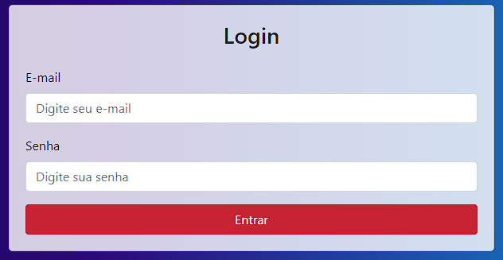

# Página de Login

## Descrição
A Página de Login é um projeto web responsivo desenvolvido para fornecer uma interface de entrada segura e intuitiva para os usuários. Este projeto foi criado com o objetivo de oferecer uma experiência amigável para os usuários durante o processo de autenticação.

## Funcionalidades Principais
- Formulário de login com campos de e-mail e senha.
- Validação básica dos campos de entrada.
- Design responsivo para se adaptar a diferentes tamanhos de tela.

## Tecnologias Utilizadas
- HTML5
- CSS3 (com pré-processador SASS/SCSS)
- JavaScript (para validação de formulário, se necessário)
- Git (para controle de versão)

## Pré-requisitos
- Navegador web moderno (Google Chrome, Mozilla Firefox, Safari, etc.)

## Como Executar Localmente
Para executar a Página de Login localmente em sua máquina, siga estas etapas:
1. Clone o repositório (`git clone https://github.com/AngeloHervis/pagina-login.git`).
2. Navegue até o diretório do projeto (`cd pagina-login`).
3. Abra o arquivo `index.html` em seu navegador web.

## Autor
Angelo Hervis
- GitHub: [AngeloHervis](https://github.com/AngeloHervis)
- LinkedIn: [Angelo Hervis](https://www.linkedin.com/in/angelo-hervis/)
